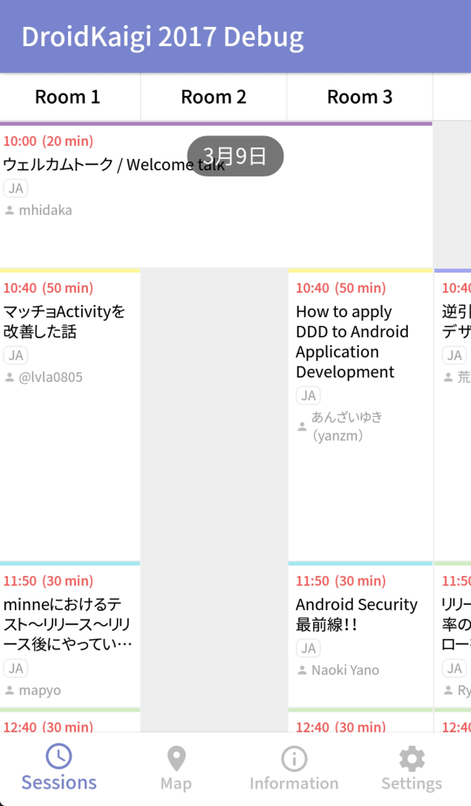
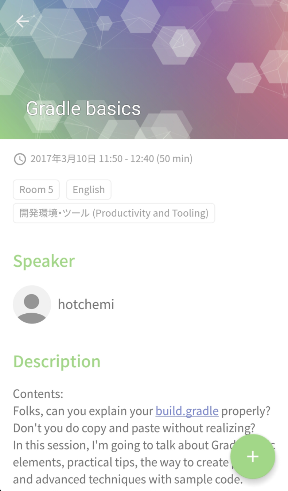
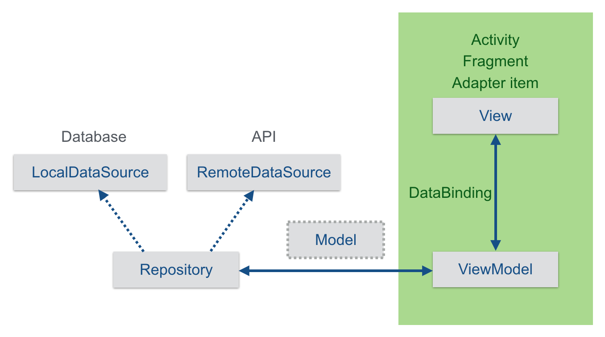

#  DroidKaigi 2017 official Android app [](https://circleci.com/gh/DroidKaigi/conference-app-2017) [](http://waffle.io/DroidKaigi/conference-app-2017) [](https://codecov.io/gh/DroidKaigi/conference-app-2017)


[DroidKaigi 2017](https://droidkaigi.github.io/2017/en/) is a conference tailored for developers on 9th and 10th March 2017.

[](https://dply.me/564onq#install)


# Features
  

- View conference schedule and details of each session
- Set notification for upcoming sessions on your preference
- View a map
- Search sessions and speakers


# Contributing
We use [waffle.io](https://waffle.io/DroidKaigi/conference-app-2017) to manage tasks. If you'd like to contribute to the project but are not sure where to start off, please look for issues labelled [welcome contribute](https://github.com/DroidKaigi/conference-app-2017/labels/welcome%20contribute).

We've designated these issues as good candidates for easy contribution. You can always fork the repository and send a pull request (on a branch other than `master`).

We do accept suggestions for translations at [this page](https://droidkaigi2017.oneskyapp.com/collaboration).

# Development Environment
This app depends on several libraries and plugins so make sure to set them up correctly.

## Java8 & retrolambda support
This project uses Java8 and [retrolambda](https://github.com/orfjackal/retrolambda). If you haven't set up Java8 yet, install it from [here](http://www.oracle.com/technetwork/java/javase/downloads/jdk8-downloads-2133151.html), and set env `JAVA_HOME` or `JAVA8_HOME`.

## Kotlin
Tests are written in Kotlin!

## DataBinding
This project tries to use [DataBinding](http://developer.android.com/intl/ja/tools/data-binding/guide.html).

```xml
<TextView
  android:id="@+id/txt_title"
  android:layout_width="wrap_content"
  android:layout_height="wrap_content"
  android:maxLines="@{viewModel.titleMaxLines}"
  android:text="@{viewModel.title}" />
```

Custom attributes are also used like below.

```xml
<ImageView
    android:id="@+id/img_speaker"
    android:layout_width="@dimen/image_size"
    android:layout_height="@dimen/image_size"
    app:photoImageUrl="@{viewModel.imageUrl}" />
```

BindingAdapter like `photoImageUrl` is written in `DataBindingHelper.java`.

```java
@BindingAdapter("photoImageUrl")
public static void setPhotoImageUrl(ImageView imageView, @Nullable String imageUrl) {
  setImageUrl(imageView, imageUrl, R.color.grey200);
}

private static void setImageUrl(ImageView imageView, @Nullable String imageUrl, @DrawableRes int placeholderResId) {
  if (TextUtils.isEmpty(imageUrl)) {
    imageView.setImageDrawable(ContextCompat.getDrawable(imageView.getContext(), placeholderResId));
  } else {
    Picasso.with(imageView.getContext())
           .load(imageUrl)
           .placeholder(placeholderResId)
           .error(placeholderResId)
           .into(imageView);
  }
}
```

## Dagger2
This project uses DI library [Dagger2](http://google.github.io/dagger/).
See classes in `di` package.

```
src/main/java/io/github/droidkaigi/confsched2017/di
|
|--scope
|  |--ActivityScope.java  : Scope annotation for objects being alive within activity lifecycle
|  |--FragmentScope.java  : Scope annotation for objects being alive within fragment lifecycle
|
|--AndroidModule.java     : Provides system services(e.g. PackageManager, ActivityManager)
|--ActivityComponent.java :
|--ActivityModule.java    : Provides activity-scoped objects
|--AppComponent.java      :
|--AppModule.java         : Provides application-scoped objects(e.g. SharedPreferences, HttpClient)
|--FragmentComponent.java :
|--FragmentModule.java    : Provides fragment-scoped objects
```

## Orma
This project uses ORM library [Android-Orma](http://gfx.github.io/Android-Orma/).
Android-Orma is a lightning-fast and annotation based wrapper library of SQLiteDatabase.

Some model classes in `model` package having `@Table` annotation.

```java
@Table
public class Session {
    @Column(indexed = true)
    @SerializedName("id")
    public int id;

    @Column(indexed = true)
    @SerializedName("title")
    public String title;

    // ...
}
```

These classes are saved and updated in database via `repository/XXXLocalDataSource`.
To know more about Android-Orma, see [document](http://gfx.github.io/Android-Orma/).


# Architecture
This app uses an simple MVVM (Model-View-ViewModel) architecture using DataBinding, dependency injection and OR-mapper.



## Model
- In `model` package.
- These models are POJO.
- They are converted from API json response via [Retrofit2](https://square.github.io/retrofit/), and stored to Database via [Android-Orma](https://github.com/gfx/Android-Orma).

```java
@Table
public class Speaker {

  @PrimaryKey(auto = false)
  @Column(indexed = true)
  @SerializedName("id")
  public int id;

  @Column(indexed = true)
  @SerializedName("name")
  public String name;

  @Column
  @Nullable
  @SerializedName("image_url")
  public String imageUrl;

  ...
}
```

## View
- In `view` package.
- "View" is not only layout xml file. Activities and Fragments are also "View".
- "View" is refreshed by viewModel when `onResume()` is called.

## ViewModel
- In `viewmodel` package
- "ViewModel" has all properties which is shown in "View".
- They are bind by DataBinding. In this app, `setText()` or `setImageResource()`, `setVisibility()` are not used.
- The events such as `OnClickListener()` are also bind by DataBinding.

```xml
<RelativeLayout
  android:layout_width="wrap_content"
  android:layout_height="wrap_content"
  android:background="@drawable/clickable_white"
  android:clickable="@{viewModel.clickable}"
  android:onClick="@{viewModel::showSessionDetail}"
  app:sessionCellBackground="@{viewModel.backgroundResId}"
  app:twowayview_colSpan="@{viewModel.colSpan}"
  app:twowayview_rowSpan="@{viewModel.rowSpan}">

  <View
    android:id="@+id/categoryBorder"
    android:layout_width="match_parent"
    android:layout_height="3dp"
    android:visibility="@{viewModel.normalSessionItemVisibility}"
    app:sessionTopicColor="@{viewModel.topicColorResId}" />
    ...

</RelativeLayout>
```

- "ViewModel" has business logic.
- If it's necessary to load data, "ViewModel" uses `Repository` class or `DefaultPref` class which are provided by [Dagger2](https://github.com/google/dagger).

```java
@Inject
SessionsViewModel(SessionsRepository sessionsRepository, MySessionsRepository mySessionsRepository) {
  this.sessionsRepository = sessionsRepository;
  this.mySessionsRepository = mySessionsRepository;
}
```


# Credit
This project uses some modern Android libraries.

- Android Support Libraries
  - Support v4
  - AppCompat
  - Support Annotations
  - Support Vector Drawables
  - Animated Vector Drawables
  - Design
  - RecyclerView
  - CustomTabs
- [Firebase](https://firebase.google.com/), [Dagger2](http://google.github.io/dagger/) and [Gson](https://github.com/google/gson) - Google
- [Retrofit2](http://square.github.io/retrofit/), [Picasso](http://square.github.io/picasso/), [OkHttp3](https://github.com/square/okhttp), [AssertJ](https://github.com/square/assertj-android) and [LeakCanary](https://github.com/square/leakcanary) - Square
- [Android-Orma](https://github.com/gfx/Android-Orma) - gfx
- [TwoWayView](https://github.com/lucasr/twoway-view) - Lucas Rocha
- [RxJava2](https://github.com/ReactiveX/RxJava) and [RxAndroid2]([RxAndroid](https://github.com/ReactiveX/RxAndroid)) - ReactiveX
- [Lightweight Stream API](https://github.com/aNNiMON/Lightweight-Stream-API) - Victor Melnik
- [Timber](https://github.com/JakeWharton/timber) - JakeWharton
- [Calligraphy](https://github.com/chrisjenx/Calligraphy) - Christopher Jenkins
- [Stetho](http://facebook.github.io/stetho/) - Facebook
- [PermissionsDispatcher](https://github.com/hotchemi/PermissionsDispatcher) - hotchemi
- [kvs-schema](https://github.com/rejasupotaro/kvs-schema) - rejasupotaro
- [Robolectric](http://robolectric.org/) - Robolectric
- [Mockito](http://site.mockito.org/) - Mockito
- [Kotlin](https://kotlinlang.org/) - JetBrains
- [Knit](https://github.com/ntaro/knit) - Taro Nagasawa
- [Kmockito](https://github.com/sys1yagi/kmockito) - sys1yagi


# License
```
Copyright 2017 DroidKaigi

Licensed under the Apache License, Version 2.0 (the "License");
you may not use this file except in compliance with the License.
You may obtain a copy of the License at

   http://www.apache.org/licenses/LICENSE-2.0

Unless required by applicable law or agreed to in writing, software
distributed under the License is distributed on an "AS IS" BASIS,
WITHOUT WARRANTIES OR CONDITIONS OF ANY KIND, either express or implied.
See the License for the specific language governing permissions and
limitations under the License.
```
